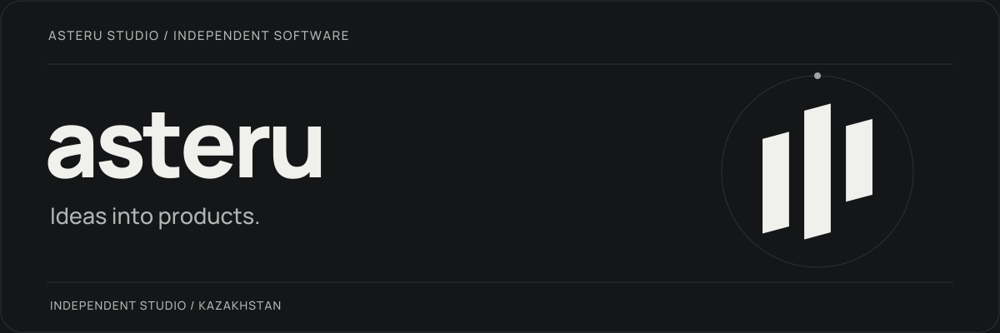

<picture>
  <source media="(prefers-reduced-motion: reduce)" srcset="assets/header.png">
  
</picture>

  <a href="https://t.me/asterustudio">Studio journal</a> &nbsp; · &nbsp;
  <a href="https://x.com/asterustudio">X / Twitter</a> &nbsp; · &nbsp;
  <a href="https://t.me/daniarjabagin">Get in touch</a>

## A small studio with work to share.

**Asteru Studio** is an independent software studio founded by
[Daniar Jabagin](https://github.com/daniarjabagin), based in Kazakhstan.

We build our own products and keep working on them after release.
This is where we share the code, tools, and experiments we make public.

### What we care about

| Useful from the start                                                     | Better with each release                                              |
| :------------------------------------------------------------------------ | :-------------------------------------------------------------------- |
| A clear purpose, a thoughtful interface, and a first version you can try. | Feedback that reaches the developers and improvements you can notice. |

### Follow a product as it takes shape.

The [studio journal](https://t.me/asterustudio) is where we post early demos,
new releases, and the decisions behind them.

Try something. Tell us what feels awkward. Share what you wish it could do.
We want that conversation to be part of how the product develops.

### Work with us

For questions, feedback, or a possible collaboration,
[message Daniar](https://t.me/daniarjabagin).

---

  Asteru Studio · Kazakhstan · Design, development, and the next iteration.

