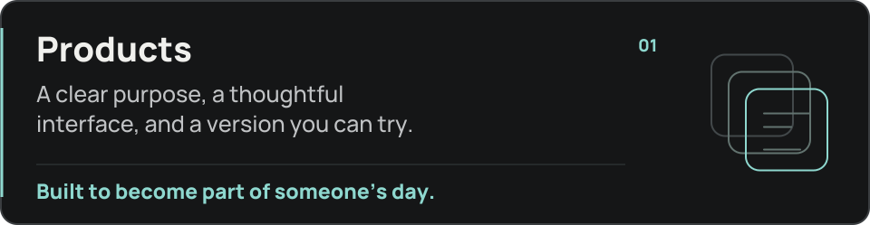
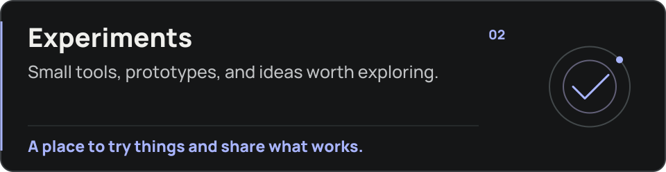

<picture>
  <source media="(prefers-reduced-motion: reduce)" srcset="assets/header.png">
  
</picture>

  
  
  

<h2 align="center">A small studio with work to share.</h2>

  Independent software studio founded by <a href="https://github.com/daniarjabagin"><strong>Daniar Jabagin</strong></a>. 
  Based in Kazakhstan. Building our own products and improving them after launch.

 

<picture>
  <source media="(max-width: 600px)" srcset="assets/panels/products-mobile.svg">
  
</picture>

<picture>
  <source media="(max-width: 600px)" srcset="assets/panels/experiments-mobile.svg">
  
</picture>

## From the studio

We share the work while it takes shape.

- **Try something early:** demos and first versions.
- **Follow the decisions:** design choices and development notes.
- **See what changed:** releases and improvements.

  

## Your feedback reaches the developers.

Tell us what feels useful, what feels awkward, or what you wish existed. 
That conversation helps us decide what to improve next.

 

<strong>Questions, feedback, or a project in mind?</strong>

  

---

Asteru Studio · Kazakhstan · Design, development, and the next iteration.

